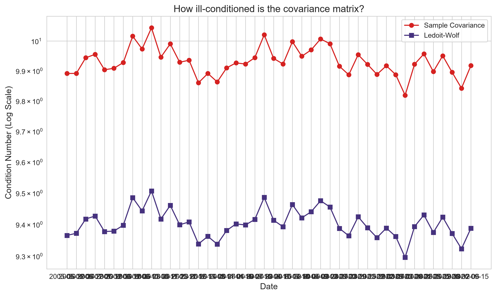
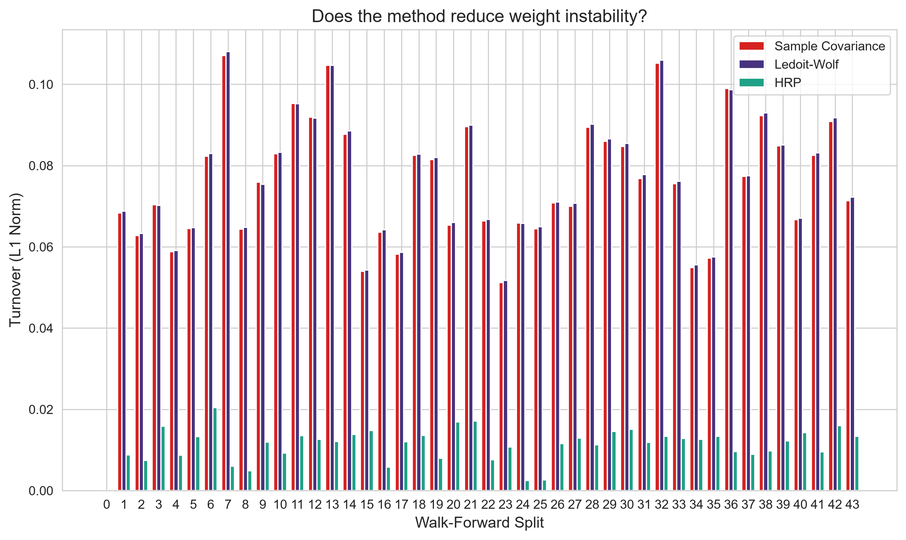
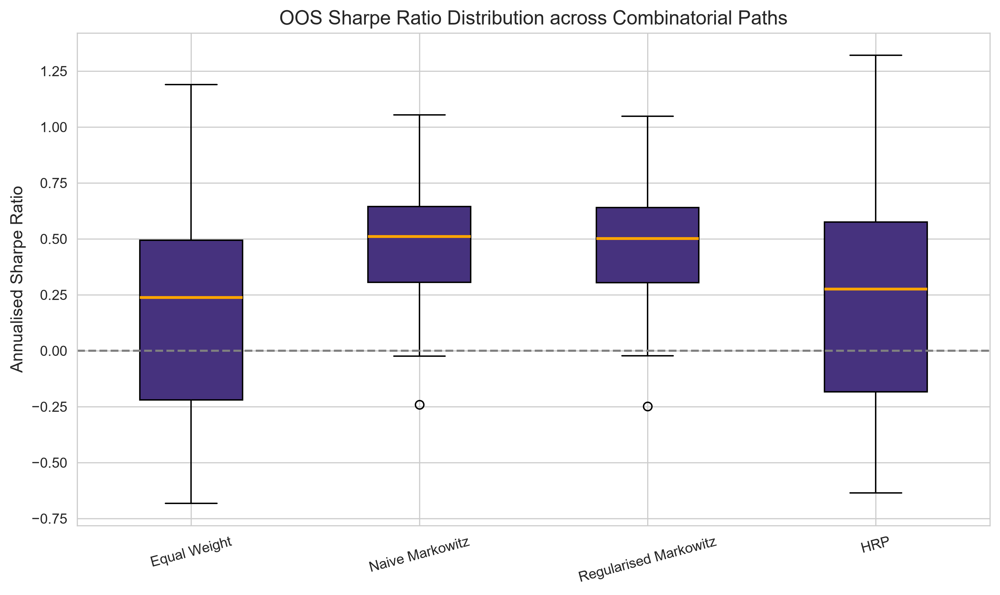
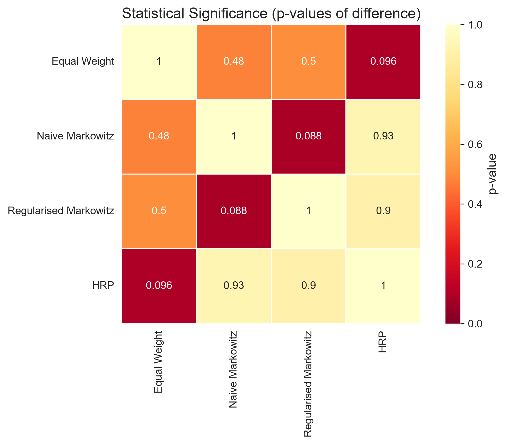

# FinMetrica Research Findings: Covariance Regularization & System Benchmark
*Generated on: 2026-09-15 14:38:42*
*Universe Name:* Diversified Alternate (Less Hindsight Bias)

## Executive Summary
This report evaluates the empirical impact of advanced portfolio structuring (Ledoit-Wolf covariance shrinkage and Hierarchical Risk Parity) on portfolio stability and out-of-sample performance.

**Core Finding:** There were **no statistically significant** differences among the methods at the 5% level after Benjamini-Hochberg multiple-comparison correction. The best point-estimate was Naive Markowitz (Sharpe 0.52), but this was not significantly better than any other method (p=0.4800).

* Regularization reduced the average condition number by **5.3%** (from 9.9 to 9.4).

## Track 1: Estimator Instability

Ledoit-Wolf shrinkage trades a small amount of bias for a large reduction in variance. This manifests as a better-conditioned covariance matrix.

This improved conditioning directly impacts the stability of the optimizer's output weights.
Average turnover (L1 norm):
- Sample Covariance: 0.075
- Ledoit-Wolf: 0.075
- HRP: 0.011

Furthermore, Hierarchical Risk Parity (HRP) achieved the lowest average turnover (0.011), empirically supporting the literature's claim that its hierarchical clustering approach produces more stable weight allocations across time than optimization approaches requiring matrix inversion.

## Track 2: Full-System Benchmark (CPCV)

### Cross-Path Stability
| Method | Mean OOS Sharpe | Std Dev OOS Sharpe | CV |
| --- | --- | --- | --- |
| Equal Weight | 0.1651 | 0.5247 | 3.1788 |
| Naive Markowitz | 0.4671 | 0.3664 | 0.7845 |
| Regularised Markowitz | 0.4650 | 0.3652 | 0.7853 |
| HRP | 0.2118 | 0.5577 | 2.6327 |

### Interpretation: Estimation Error and the Limits of Optimization

HRP is the only one of the four methods that does not use the expected-return vector (mu) at all — it allocates purely from the correlation and distance structure via recursive bisection. Both Markowitz variants (naive and regularized) use the noisy sample mean (mu_hat).

Ledoit-Wolf shrinkage in this experiment only regularizes the covariance matrix, not mu — so if mu estimation error is the dominant source of instability, Sigma-regularization alone would show little benefit. This pattern is consistent with **Chopra, V.K. and Ziemba, W.T. (1993), "The Effect of Errors in Means, Variances, and Covariances on Optimal Portfolio Choice," Journal of Portfolio Management**, which found that errors in mean estimates are typically far more damaging to portfolio choice than errors in the covariance matrix.

This pattern — where no structured method significantly beats naive equal-weighting out-of-sample — is consistent with the finding in **DeMiguel, V., Garlappi, L., and Uppal, R. (2009), 'Optimal Versus Naive Diversification: How Inefficient is the 1/N Portfolio Strategy?', Review of Financial Studies, 22(5), 1915–1953**, which reported that naive 1/N equal-weighting is difficult to beat across many 'optimal' portfolio construction methods, because estimation error in the inputs erodes the theoretical benefits of optimization. **Note:** This citation is included as a qualitative framing consistent with the observed pattern — the user should verify specific claims against the source before treating them as confirmed.

In this run, HRP does NOT have the lowest cross-path Sharpe standard deviation (its std is 0.5577, while the minimum was 0.3652). A pure 'wins on consistency' argument is therefore not supported by these numbers.

*Note: These are plausible explanations consistent with the observed patterns, not proven causal mechanisms.*

**Suggested Future Extension:** Introduce a fifth method (Ledoit-Wolf Sigma combined with a Minimum-Variance objective that ignores mu) to isolate whether "mu-avoidance" explains HRP's edge, versus something specific to HRP's clustering structure.

### Overfitting Check: Deflated Sharpe Ratio
After adjusting for having tried 5 methods, the probability that Naive Markowitz's true Sharpe ratio exceeds the multiple-testing-adjusted benchmark of 0.215417 is **100.0000%**, versus a naive (non-deflated) read of the raw Sharpe ratio.

*Sample-size note: n_observations = 1886, representing the number of unique calendar dates in the date-averaged ensemble return series (overlapping CPCV paths are averaged per date before computing this, so this is NOT a naive pooled count). Using the single representative fold size would give a more conservative estimate; users should treat extremely high DSR values (>99%) with caution when n_observations is large.*

### Statistical Significance

The table below displays all pairwise Jobson-Korkie-Memmel and stationary-bootstrap tests for out-of-sample Sharpe equivalence, with Bonferroni and Benjamini-Hochberg (FDR) corrections applied.

| Method A | Method B | Sharpe A | Sharpe B | Raw p-val | Bonferroni p | BH p-val | Sig (BH 5%) |
| --- | --- | --- | --- | --- | --- | --- | --- |
| Equal Weight | Naive Markowitz | 0.1658 | 0.5189 | 0.4800 | 1.0000 | 0.8367 | False |
| Equal Weight | LW-Shrinkage-Only Markowitz | 0.1658 | 0.5169 | 0.5020 | 1.0000 | 0.8367 | False |
| Equal Weight | Regularised Markowitz | 0.1658 | 0.5169 | 0.5020 | 1.0000 | 0.8367 | False |
| Equal Weight | HRP | 0.1658 | 0.2126 | 0.0960 | 0.9600 | 0.3200 | False |
| Naive Markowitz | LW-Shrinkage-Only Markowitz | 0.5189 | 0.5169 | 0.0880 | 0.8800 | 0.3200 | False |
| Naive Markowitz | Regularised Markowitz | 0.5189 | 0.5169 | 0.0880 | 0.8800 | 0.3200 | False |
| Naive Markowitz | HRP | 0.5189 | 0.2126 | 0.9280 | 1.0000 | 1.0000 | False |
| LW-Shrinkage-Only Markowitz | Regularised Markowitz | 0.5169 | 0.5169 | 1.0000 | 1.0000 | 1.0000 | False |
| LW-Shrinkage-Only Markowitz | HRP | 0.5169 | 0.2126 | 0.9040 | 1.0000 | 1.0000 | False |
| Regularised Markowitz | HRP | 0.5169 | 0.2126 | 0.9040 | 1.0000 | 1.0000 | False |

## Known Limitations

**Survivorship and Hindsight Bias**
This run was evaluated from `2005-01-01` using the following `Diversified Alternate (Less Hindsight Bias)` universe:
`AAPL, MSFT, GE, C, INTC, JNJ, PFE, UNH, JPM, BAC, GS, WFC, XOM, CVX, COP, PG, KO, HD, MCD, CSCO`

If this list was selected using present-day knowledge of which companies became successful, applying it backward to a start date before that outcome was known represents a form of hindsight/survivorship bias. This likely inflates the *absolute* Sharpe ratios for all methods since they share the same biased universe.

While the *relative* comparison between methods is less affected since all are evaluated on the identical universe, this is an assumption. Evaluating against a point-in-time unbiased universe or a deliberately diverse alternate universe is recommended to verify these findings hold.

## Conclusion
There were **no statistically significant** differences among the methods at the 5% level after Benjamini-Hochberg multiple-comparison correction. The best point-estimate was Naive Markowitz (Sharpe 0.52), but this was not significantly better than any other method (p=0.4800).
